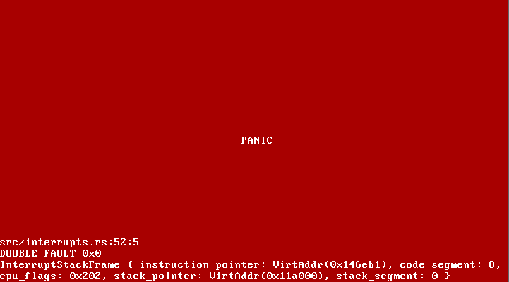

Runix is a WIP unikernel. The name "runix" stands for: Runix Has Nothing To Do With Unix.

# Welcome page


# Red screen of death


# Building and running
```
$ make
$ make run
```

# Debug kernel
```SH
$ qemu-system-x86_64 -cdrom runix.iso -no-shutdown -no-reboot -d int -s -S
$ gdb src/boot/kernel.bin
(gdb) target remote localhost:1234
(gdb) c
```
